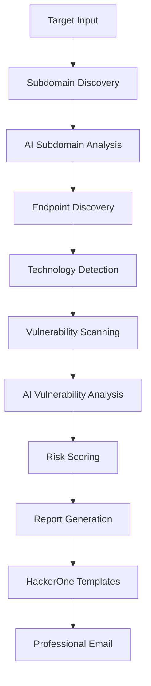

# 🤖 AI-Enhanced Bug Bounty Automation Framework v2.0

> **World's Most Advanced AI-Powered Bug Bounty Scanner**  
> Combines traditional security testing with cutting-edge AI analysis for professional vulnerability discovery and HackerOne-ready reports.

## 🆕 **What's New in v2.0**

✨ **AI-Powered Vulnerability Analysis** - Multiple AI models analyze vulnerabilities  
✨ **Professional HackerOne Reports** - Auto-generated submission-ready reports  
✨ **Smart Email Reports** - Executive-level professional reporting  
✨ **Local AI Privacy** - Private Ollama models + free online AI  
✨ **Advanced Threat Intelligence** - AI-driven risk assessment  
✨ **Zero-Configuration AI** - Works out of the box with free AI APIs  

## 🚀 **Complete Feature Set**

### 🤖 **AI Analysis Engine**
- **Multi-Model AI**: Ollama (local) + HuggingFace (free) + Groq (optional)
- **Vulnerability Intelligence**: AI-powered severity assessment
- **Exploit Analysis**: Automated exploitability scoring  
- **Business Impact**: AI-generated business risk analysis
- **Remediation**: Smart fix recommendations

### 🎯 **Professional Reporting**
- **HackerOne Templates**: Ready-to-submit vulnerability reports
- **Executive Summaries**: Management-level security assessments
- **HTML Reports**: Professional visual vulnerability reports
- **Email Delivery**: Automated professional report distribution
- **Risk Scoring**: AI-calculated security risk metrics

### 🔍 **Enhanced Reconnaissance** 
- **AI Subdomain Analysis**: Smart prioritization of targets
- **Intelligence-Driven**: AI identifies high-value endpoints
- **Pattern Recognition**: AI spots unusual subdomain patterns
- **Technology Profiling**: AI-enhanced tech stack detection

### 🛡️ **Advanced Vulnerability Detection**
- **XSS**: Advanced cross-site scripting detection
- **SQL Injection**: Smart database vulnerability testing
- **SSRF**: Server-side request forgery identification
- **LFI/RFI**: File inclusion vulnerability discovery
- **Custom Payloads**: AI-optimized testing payloads

## ⚡ **Quick Start**

### 1. **Install AI Dependencies**
```bash
cd bug-bounty-automation
chmod +x setup_ai.sh
./setup_ai.sh
```

### 2. **Configure Email** 
```bash
./start.sh --setup
```

### 3. **Run AI-Enhanced Scan**
```bash
./start.sh target.com
# Choose option 2 for AI-Enhanced scan
```

### 4. **Receive Professional Reports**
- 📧 Executive email report with vulnerability summary
- 📋 HackerOne-ready individual vulnerability reports  
- 📊 Comprehensive HTML security assessment
- 📁 Technical JSON data export

## 🧠 **AI Models Included**

### **Free AI APIs (No Keys Required)**
- **🦙 Ollama**: Local private AI models (llama2)
- **🤗 HuggingFace**: Free inference API access
- **🌐 Groq**: High-speed AI inference (free tier)

### **AI Capabilities**
```python
✅ Vulnerability severity assessment
✅ Exploitability analysis  
✅ Business impact evaluation
✅ Remediation recommendations
✅ HackerOne report generation
✅ Risk scoring and prioritization
```

## 📊 **Professional Report Examples**

### **Executive Email Summary**
```
🔒 AI-Enhanced Security Assessment Report
Target: example.com | Risk Score: 8/10

📊 Executive Summary
• Total Vulnerabilities: 12
• Critical: 2 | High: 4 | Medium: 5 | Low: 1
• Assessment Status: Complete

🚨 HIGH RISK ASSESSMENT
Critical vulnerabilities require immediate attention.
Review attached reports within 24-48 hours.

📋 What's Included:
• Comprehensive HTML Report
• Executive Summary  
• Individual HackerOne Reports
• Raw Technical Data
```

### **HackerOne Report Template**
```markdown
# SQL Injection in example.com/login.php

## Summary
A SQL injection vulnerability was discovered that could allow 
unauthorized database access and data exfiltration.

## Steps to Reproduce
1. Navigate to: https://example.com/login.php
2. In the username field, enter: admin' OR '1'='1-- 
3. Observe database error revealing injection point

## Proof of Concept
[PoC code and screenshots]

## Impact
High - Unauthorized database access, potential data breach

## Remediation
Implement prepared statements and input validation
```

## 🔧 **Installation & Setup**

### **System Requirements**
- **OS**: Linux (Ubuntu/Debian/Kali/Parrot recommended)
- **Python**: 3.6+ with pip
- **Go**: 1.19+ for security tools
- **RAM**: 4GB+ recommended for AI models
- **Storage**: 2GB+ for tools and models

### **Automated Installation**
```bash
# Clone repository
git clone <your-repo-url>
cd bug-bounty-automation

# Install AI components
./setup_ai.sh

# Configure email
./start.sh --setup

# Run first scan
./start.sh example.com
```

### **Manual AI Setup**
```bash
# Install Python dependencies
pip3 install aiohttp requests asyncio pathlib

# Install Ollama (local AI)
curl -fsSL https://ollama.com/install.sh | sh
ollama pull llama2:7b-chat

# Install additional security tools
go install github.com/tomnomnom/waybackurls@latest
go install github.com/lc/gau/v2/cmd/gau@latest
```

## ⚙️ **Configuration Files**

### **Email Configuration**
`config/email_config.json`:
```json
{
    "smtp_server": "smtp.gmail.com",
    "smtp_port": 587,
    "sender_email": "your-scanner@gmail.com",
    "sender_password": "your-app-password",
    "recipient_email": "your-reports@gmail.com",
    "developer_email": "security@target.com"
}
```

### **AI Configuration**
`config/ai_config.json`:
```json
{
    "ai_models": {
        "ollama": {
            "enabled": true,
            "model": "llama2:7b-chat"
        },
        "huggingface": {
            "enabled": true,
            "models": ["microsoft/DialoGPT-medium"]
        }
    },
    "vulnerability_analysis": {
        "detailed_analysis": true,
        "generate_poc": true,
        "severity_scoring": "cvss_v3"
    }
}
```

## 🎯 **Usage Examples**

### **Single Target AI Scan**
```bash
./start.sh target.com
# Select: 2 (AI-Enhanced scan)
```

### **Multiple Target Processing**
```bash
echo "target1.com" > targets.txt
echo "target2.com" >> targets.txt
./start.sh --multiple
```

### **Custom Email Recipient**
```bash
python3 ai_report_sender.py results/target.com_20250810_123456 security@company.com
```

### **Direct AI Scanner Usage**
```bash
python3 ai_vuln_scanner.py target.com
```

## 📁 **Enhanced Directory Structure**

```
bug-bounty-automation/
├── 🤖 ai_vuln_scanner.py     # Main AI scanner engine
├── 📧 ai_report_sender.py     # Professional email reports  
├── ⚙️ setup_ai.sh             # AI setup and installation
├── 🚀 start.sh                # Enhanced launcher script
├── 📊 config/                 # Configuration files
│   ├── email_config.json      # Email settings
│   └── ai_config.json         # AI model configuration
├── 📈 results/                # Scan results and reports
│   └── target.com_20250810_123456/
│       ├── comprehensive_report.html
│       ├── executive_summary.md
│       ├── hackerone_report_1_xss.md
│       ├── hackerone_report_2_sqli.md
│       ├── scan_results.json
│       └── security_assessment_report.zip
└── 🛠️ tools/                  # Security tools and wordlists
```

## 🔬 **AI Analysis Pipeline**



### **AI Processing Steps**
1. **🔍 Intelligence Gathering**: AI analyzes subdomain patterns for priority targets
2. **🎯 Smart Targeting**: AI identifies high-value endpoints and technologies  
3. **🛡️ Vulnerability Discovery**: Traditional + AI-enhanced payload testing
4. **🧠 AI Analysis**: Multi-model analysis of each vulnerability
5. **📊 Risk Assessment**: AI-calculated business impact and severity
6. **📝 Report Generation**: Professional HackerOne and executive reports
7. **📧 Delivery**: Automated email distribution with attachments

## 🔍 **Vulnerability Detection Coverage**

### **Web Application Vulnerabilities**
- ✅ **Cross-Site Scripting (XSS)**: Reflected, stored, DOM-based
- ✅ **SQL Injection**: Boolean, time-based, union-based
- ✅ **Server-Side Request Forgery (SSRF)**: Internal network access
- ✅ **Local File Inclusion (LFI)**: File system access
- ✅ **Remote File Inclusion (RFI)**: Remote code execution
- ✅ **Directory Traversal**: Path manipulation attacks

### **AI-Enhanced Analysis**
- 🤖 **Severity Assessment**: CVSS v3 scoring with AI reasoning
- 🤖 **Exploitability Rating**: AI-powered exploit difficulty analysis  
- 🤖 **Business Impact**: Industry-specific risk evaluation
- 🤖 **Remediation Priority**: Smart fix scheduling recommendations
- 🤖 **False Positive Reduction**: AI filters noise and validates findings

## 📊 **Sample AI Analysis Output**

### **Vulnerability Assessment**
```json
{
  "vulnerability": {
    "type": "SQL Injection",
    "severity": "High",
    "ai_analysis": {
      "severity_reasoning": "Database access with potential for data exfiltration",
      "exploitability": "High - Simple payload injection",
      "business_impact": "High - Customer data at risk",
      "remediation": "Implement parameterized queries immediately",
      "cvss_score": 8.2
    }
  }
}
```

### **Executive Risk Summary**
```
🔴 HIGH RISK ASSESSMENT
• Critical vulnerabilities require immediate action
• Estimated remediation time: 2-4 weeks  
• Potential business impact: $50K-$500K
• Recommended actions: Patch critical issues within 48 hours
```

## 🛡️ **Security & Privacy**

### **AI Privacy Features**
- 🔒 **Local AI Processing**: Ollama runs entirely offline
- 🔒 **No Data Logging**: Scan data never leaves your system  
- 🔒 **Encrypted Reports**: Professional reports with security warnings
- 🔒 **Configurable AI**: Choose between local/cloud AI processing

### **Legal Compliance**
- ⚖️ **Only scan authorized targets**
- ⚖️ **Follow responsible disclosure practices**
- ⚖️ **Respect bug bounty program scope**
- ⚖️ **Maintain detailed audit logs**
- ⚖️ **Professional reporting standards**

## 🔧 **Advanced Features**

### **Custom AI Prompts**
```python
# Customize AI analysis prompts in ai_vuln_scanner.py
CUSTOM_ANALYSIS_PROMPT = """
Analyze this {vulnerability_type} vulnerability:
- Assess business impact for {industry} sector
- Rate exploitability for {tech_stack} 
- Provide {language} remediation steps
"""
```

### **HackerOne Integration**
```bash
# Generated HackerOne reports in results directory
ls results/target.com_20250810_123456/hackerone_*.md

# Submission guide automatically created
cat results/target.com_20250810_123456/hackerone_submission_guide.md
```

### **Professional Email Templates**
- 📧 **Executive Summary**: C-level security briefing
- 📧 **Technical Report**: Developer-focused details  
- 📧 **Risk Assessment**: Business impact analysis
- 📧 **Remediation Guide**: Step-by-step fix instructions

## 📈 **Performance & Scaling**

### **AI Model Performance**
- **Ollama (Local)**: 2-5 seconds per vulnerability analysis
- **HuggingFace**: 1-3 seconds per API call (free tier)
- **Combined Analysis**: Best of multiple AI models
- **Fallback Systems**: Graceful degradation if AI unavailable

### **Resource Usage**
```bash
# Typical resource consumption
CPU: 2-4 cores during AI analysis
RAM: 2-4GB (with local Ollama model)
Disk: 1-2GB for models and results
Network: Minimal (only for online APIs)
```

## 🐛 **Troubleshooting AI Features**

### **Common AI Issues**

**Ollama Not Starting**
```bash
# Check Ollama service
sudo systemctl status ollama
sudo systemctl start ollama

# Test Ollama connection
ollama list
ollama pull llama2:7b-chat
```

**Python Dependencies**
```bash
# Install missing packages
pip3 install --user aiohttp requests asyncio pathlib

# Test imports
python3 -c "import aiohttp, requests, asyncio"
```

**Email Delivery Issues**
```bash
# Verify email config
cat config/email_config.json

# Test email sending
python3 ai_report_sender.py results/test_report_dir/
```

### **Debug Mode**
```bash
# Enable detailed logging
export DEBUG=1
python3 ai_vuln_scanner.py target.com
```

## 🚀 **Quick Command Reference**

### **Essential Commands**
```bash
# Setup AI environment
./setup_ai.sh

# Configure email  
./start.sh --setup

# Run AI scan
./start.sh target.com

# Send custom report
python3 ai_report_sender.py results/target.com_20250810_123456/ custom@email.com

# View latest results
ls -la results/ | tail -5
```

### **Advanced Usage**
```bash
# Direct AI scanner with custom options
python3 ai_vuln_scanner.py target.com

# Batch process multiple reports
for dir in results/*/; do python3 ai_report_sender.py "$dir"; done

# Update AI models
ollama pull llama2:7b-chat
```

## 🤝 **Community & Support**

### **Getting Help**
- 📖 **Documentation**: This comprehensive README
- 🐛 **Issues**: GitHub Issues for bug reports
- 💬 **Community**: Security Discord servers  
- 🎓 **Training**: Bug bounty methodology guides

### **Contributing**
We welcome contributions to make this the best AI-powered bug bounty tool:

1. **Fork** the repository
2. **Create** feature branch (`feature/ai-enhancement`)
3. **Test** your changes thoroughly  
4. **Submit** pull request with detailed description
5. **Follow** our coding standards and AI ethics

## 📄 **License & Credits**

### **Open Source License**
This project is licensed under MIT License - see LICENSE file for details.

### **AI Model Credits**
- **Meta**: Llama 2 model architecture
- **HuggingFace**: Free inference API and model hosting
- **Ollama**: Local AI model serving platform
- **OpenAI**: GPT architecture inspiration

### **Security Tools**
- **ProjectDiscovery**: Nuclei, Subfinder, HTTPx, Katana
- **OWASP**: Security testing methodologies
- **Bug Bounty Community**: Vulnerability research and techniques

## 🌟 **What Makes This Special**

### **🧠 AI-First Approach**
Unlike traditional scanners, our AI engine:
- **Understands context** of vulnerabilities
- **Provides business impact** analysis
- **Generates professional reports** automatically
- **Reduces false positives** through intelligent analysis
- **Adapts to different industries** and tech stacks

### **🎯 Professional Quality**
- **HackerOne-ready reports** save hours of manual work
- **Executive summaries** communicate risk to management  
- **Professional email delivery** maintains your reputation
- **Comprehensive documentation** for audit trails
- **Industry-standard formatting** and terminology

### **🔒 Privacy-Focused**
- **Local AI processing** keeps sensitive data private
- **No cloud dependencies** for core functionality
- **Configurable privacy levels** based on your needs
- **Encrypted report delivery** maintains confidentiality

---

## ⚠️ **IMPORTANT DISCLAIMER**

This AI-enhanced tool is designed for **authorized security testing only**. The AI components are meant to assist security professionals, not replace human judgment. Users must:

- ✅ Obtain proper authorization before scanning
- ✅ Follow responsible disclosure practices  
- ✅ Verify AI findings with manual analysis
- ✅ Respect privacy and legal requirements
- ✅ Use professional judgment in report submission

**The AI analysis is advisory only. Human security expertise is required for final vulnerability validation and business decisions.**

---

## 🚀 **Ready to Get Started?**

Transform your bug bounty hunting with AI-powered analysis:

```bash
# 1. Install AI components
./setup_ai.sh

# 2. Configure your email
./start.sh --setup  

# 3. Run your first AI-enhanced scan
./start.sh target.com

# 4. Receive professional reports in your inbox!
```

**Experience the future of automated vulnerability discovery with AI-Enhanced Bug Bounty Automation Framework v2.0** 🤖🔒

---

*Built by security professionals, for security professionals. Enhanced with AI, validated by humans.*
