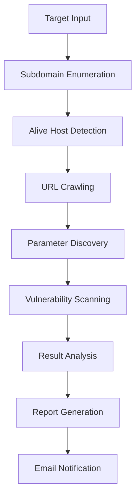

# 🎯 Bug Bounty Automation Framework

**Complete automated bug bounty system that discovers vulnerabilities, emails you first, waits for your approval, then notifies developers with detailed reports. Everything is logged and debugged for transparency.**

## 🚀 **What This System Does**

✅ **Runs recon + scanning + crawling automatically**  
✅ **Detects vulnerabilities with accuracy**  
✅ **Debug logs everything so you can see what happened**  
✅ **Emails you first when bugs are found (with detailed report)**  
✅ **Emails the developer after you approve it**  
✅ **Works fully automated from the terminal**  

## 🚀 Features

### 🔍 **Reconnaissance**
- **Subdomain Discovery**: Subfinder, Amass, Assetfinder
- **Alive Host Detection**: HTTPx with threading
- **Asset Enumeration**: Comprehensive domain mapping

### 🕷️ **Web Crawling**
- **URL Discovery**: Katana, GAU, Hakrawler
- **Parameter Extraction**: Automated parameter identification
- **Deep Crawling**: Multi-level site exploration

### 🛡️ **Vulnerability Scanning**
- **Nuclei Integration**: 1000+ vulnerability templates
- **XSS Detection**: Dalfox automated XSS scanning  
- **SQL Injection**: SQLMap integration with smart targeting
- **Custom Payloads**: Extensible payload system

### 📊 **Reporting**
- **HTML Reports**: Professional vulnerability reports
- **Email Notifications**: Instant alert system
- **Detailed Logs**: Complete audit trail
- **Export Formats**: Multiple output formats

### ⚡ **Automation**
- **Zero Configuration**: Works out of the box
- **Error Handling**: Robust error recovery
- **Resource Management**: Smart timeout controls
- **Parallel Processing**: Multi-threaded execution

## 📦 Installation

### **Automated Installation**
```bash
git clone https://github.com/your-repo/bug-bounty-automation
cd bug-bounty-automation
chmod +x install.sh
./install.sh
```

### **Manual Requirements**
- **Operating System**: Linux (Ubuntu/Debian/Kali/Parrot)
- **Go Language**: 1.19+ for tool compilation
- **Python**: 3.6+ for email system
- **Dependencies**: curl, wget, git, jq

## ⚙️ Configuration

### **Email Settings**
Edit `config/email_config.json`:
```json
{
    "smtp_server": "smtp.gmail.com",
    "smtp_port": 587,
    "sender_email": "your-email@gmail.com", 
    "sender_password": "your-app-password",
    "recipient_email": "your-email@gmail.com",
    "developer_email": "developer@target-company.com"
}
```

### **API Keys (Optional)**
Add to `~/.config/subfinder/provider-config.yaml`:
```yaml
virustotal: ["YOUR_VT_API_KEY"]
shodan: ["YOUR_SHODAN_API_KEY"]
censys: ["YOUR_CENSYS_API_ID:YOUR_CENSYS_SECRET"]
```

## 🎯 Usage

### **Quick Single Target Scan**
```bash
./quick-scan.sh example.com
```

### **Multiple Target Scan**
```bash
# Create targets file
echo "example.com" > targets.txt
echo "test.com" >> targets.txt

# Run full scan
./hunt.sh targets.txt
```

### **Custom Wordlists**
```bash
# Add custom wordlists to tools/wordlists/
cp /path/to/custom.txt tools/wordlists/
```

## 📁 Directory Structure

```
bug-bounty-automation/
├── 📜 install.sh          # Main installer
├── 🎯 hunt.sh             # Core hunting engine  
├── ⚡ quick-scan.sh       # Single target scanner
├── 📧 send_email.py       # Email notification system
├── 📊 config/             # Configuration files
├── 🛠️ tools/              # Tool binaries and wordlists  
├── 📈 results/            # Scan results and sessions
├── 📋 logs/               # Debug and error logs
└── 📖 README.md           # This file
```

## 🔍 Scan Process Flow



### **Detailed Pipeline**

1. **🔍 Reconnaissance Phase**
   - Subfinder: Passive subdomain discovery
   - Amass: OSINT-based enumeration
   - Assetfinder: Fast subdomain finder
   - HTTPx: Alive host verification

2. **🕷️ Crawling Phase**
   - Katana: Modern web crawler
   - GAU: Historical URL discovery
   - Hakrawler: Parameter-focused crawling

3. **🛡️ Vulnerability Phase**
   - Nuclei: Template-based vulnerability scanning
   - Dalfox: Advanced XSS detection
   - SQLMap: SQL injection testing

4. **📊 Reporting Phase**
   - HTML report generation
   - Vulnerability categorization
   - Email alert system

## 📊 Sample Output

### **Terminal Output**
```bash
🚀 Starting Bug Bounty Automation Framework
🎯 Processing target: example.com
✅ Found 127 subdomains for example.com
✅ Found 89 alive hosts
✅ Collected 2,847 URLs (342 with parameters)
🚨 Nuclei found vulnerabilities!
⚡ XSS vulnerabilities found by Dalfox!
✅ Report generated: /home/user/results/example.com_20240109_143022/reports/final_report.html
📧 Email notification sent successfully
```

### **Email Alert Example**
```
Subject: 🚨 URGENT: Bug Bounty Alert - example.com (5 vulnerabilities)

🎯 Bug Bounty Scan Complete
Target: example.com
Status: 🔴 HIGH - HIGH PRIORITY

📊 Summary:
• 127 Subdomains Found
• 89 Alive Hosts  
• 2,847 URLs Crawled
• 5 Vulnerabilities Detected

🚨 Critical Findings:
• SQL Injection in login.php
• XSS in search parameter
• Directory traversal vulnerability
```

## 🛡️ Security & Legal

### **⚠️ Legal Requirements**
- ✅ **Only scan domains you own**
- ✅ **Have explicit written permission**
- ✅ **Follow responsible disclosure**
- ✅ **Respect bug bounty program scope**
- ❌ **Never scan without authorization**

### **🔒 Ethical Guidelines**
- Document all testing activities
- Report vulnerabilities responsibly  
- Respect rate limits and scope
- Use isolated testing environments
- Follow coordinated disclosure timelines

## 🔧 Advanced Configuration

### **Custom Nuclei Templates**
```bash
# Add custom templates
mkdir -p tools/custom-templates
nuclei -update-templates
nuclei -t tools/custom-templates/ -l targets.txt
```

### **Timeout Customization**
Edit timeouts in `hunt.sh`:
```bash
# Reconnaissance timeouts
SUBFINDER_TIMEOUT=300
AMASS_TIMEOUT=600
NUCLEI_TIMEOUT=1800
```

### **Scan Intensity Levels**
```bash
# Light scan (fast)
NUCLEI_SEVERITY="high,critical"
SQLMAP_LEVEL=1

# Deep scan (thorough)  
NUCLEI_SEVERITY="low,medium,high,critical"
SQLMAP_LEVEL=3
```

## 📈 Performance Optimization

### **Resource Management**
- **Threading**: Optimized for multi-core systems
- **Memory**: Efficient memory usage patterns
- **Disk I/O**: Smart caching mechanisms
- **Network**: Rate limiting and retry logic

### **Scaling Tips**
```bash
# For large targets (1000+ subdomains)
export HTTPX_THREADS=100
export NUCLEI_RATE_LIMIT=50

# For cloud environments
ulimit -n 65535  # Increase file descriptors
```

## 🐛 Troubleshooting

### **Common Issues**

**Tools Not Found**
```bash
# Ensure Go tools are in PATH
export PATH="$PATH:$HOME/go/bin"
source ~/.bashrc
```

**Email Not Sending**
```bash
# Check email config
cat config/email_config.json
# Use app password for Gmail
# Enable 2FA and generate app password
```

**Permission Errors** 
```bash
# Fix file permissions
chmod +x *.sh
chmod 755 tools/
```

**Timeout Issues**
```bash
# Increase timeouts for large targets
vim hunt.sh  # Edit timeout values
```

### **Debug Mode**
```bash
# Enable debug logging
export DEBUG=1
./hunt.sh targets.txt
```

## 🔄 Updates & Maintenance

### **Update Tools**
```bash
# Update Nuclei templates
nuclei -update-templates

# Update Go tools
go install -v github.com/projectdiscovery/subfinder/v2/cmd/subfinder@latest
go install -v github.com/projectdiscovery/nuclei/v3/cmd/nuclei@latest
```

### **Maintenance Tasks**
```bash
# Clean old results (keep last 30 days)
find results/ -type d -mtime +30 -exec rm -rf {} +

# Update wordlists
curl -s "https://raw.githubusercontent.com/danielmiessler/SecLists/master/Discovery/Web-Content/common.txt" > tools/wordlists/common.txt
```

## 🤝 Contributing

We welcome contributions! Please:

1. Fork the repository
2. Create feature branch
3. Follow coding standards
4. Add tests for new features
5. Submit pull request

## 📄 License

This project is licensed under MIT License - see LICENSE file for details.

## 🙏 Acknowledgments

- **ProjectDiscovery Team** - Amazing security tools
- **OWASP** - Vulnerability research
- **Bug Bounty Community** - Continuous inspiration
- **Open Source Security** - Making the web safer

## 🆘 Support

- **Documentation**: Check this README
- **Issues**: GitHub Issues page  
- **Community**: Security Discord servers
- **Professional Support**: Available on request

---

**⚠️ IMPORTANT DISCLAIMER**

This tool is for authorized security testing only. Users are responsible for complying with all applicable laws and obtaining proper authorization before scanning any systems. The developers assume no liability for misuse of this software.

**Remember: With great power comes great responsibility. Use these tools ethically and legally.**

---

*Generated by Bug Bounty Automation Framework v1.0*
